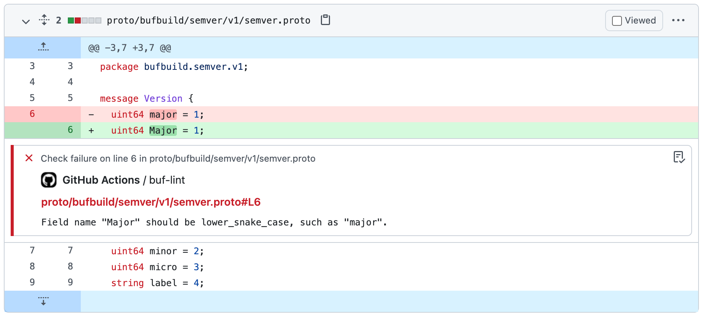

# `buf-lint-action`

This [Action] enables you to [lint] Protobuf files with [Buf] in your GitHub Actions pipelines. If
it detects violations of your configured [lint rules][lint.rules], it automatically creates inline
comments under the rule-breaking lines in your `.proto` files.



## Usage

Here's an example usage of `buf-lint-action`:

```yaml
on: pull_request # Apply to all pull requests
jobs:
  lint-protos:
    # Run `git checkout`
    - uses: actions/checkout@v2
    # Install the `buf` CLI
    - uses: bufbuild/buf-setup-action@v1
    # Lint your Protobuf sources
    - uses: bufbuild/buf-lint-action@v1
```

With this configuration, the `buf` CLI runs the lint checks specified in your [`buf.yaml`][buf-yaml]
configuration file. If any violations are detected, `buf-lint-action` creates inline comments under
the rule-breaking lines in your `.proto` files in the pull request.

## Prerequisites

For `buf-lint-action` to work, you need to install the `buf` CLI in the GitHub Actions Runner first.
We recommend using [`buf-setup-action`][buf-setup] to install it (as in the example
[above](#usage)).

## Configuration

| Parameter   | Description                                                            | Required | Default |
| :---------- | :--------------------------------------------------------------------- | :------- | :------ |
| `input`     | The path of the [Buf input][input] you want to lint check, root folder |          | `.`     |
| `buf_token` | The Buf [authentication token][token] used for any private [input]     | ✅        |
| `path`      | Service folder                                                         |          | ` `     |

> These parameters are derived from [`action.yml`](./action.yml)

## Common tasks

### Run against input in sub-directory

Some repositories are structured in such a way that their [`buf.yaml`][buf-yaml] is defined in a
sub-directory alongside their Protobuf sources, such as a `proto` directory. Here's an example:

```sh
$ tree
.
└── proto
    ├── acme
    │   └── weather
    │       └── v1
    │           └── weather.proto
    └── buf.yaml
```

In that case, you can target the `proto` sub-directory by setting `input` to `proto`:

```yaml
steps:
  - uses: actions/checkout@v2
  - uses: bufbuild/buf-setup-action@v1
  # Run lint only in the `proto` sub-directory
  - uses: bufbuild/buf-lint-action@v1
    with:
      input: proto
```

[action]: https://docs.github.com/actions
[buf]: https://buf.build
[buf-breaking]: https://github.com/marketplace/actions/buf-breaking
[buf-push]: https://github.com/marketplace/actions/buf-push
[buf-setup]: https://github.com/bufbuild/buf-setup-action
[buf-yaml]: https://docs.buf.build/configuration/v1/buf-yaml
[input]: https://docs.buf.build/reference/inputs
[lint]: https://docs.buf.build/lint/usage
[lint.rules]: https://docs.buf.build/lint/rules
[token]: https://docs.buf.build/bsr/authentication#create-an-api-token
